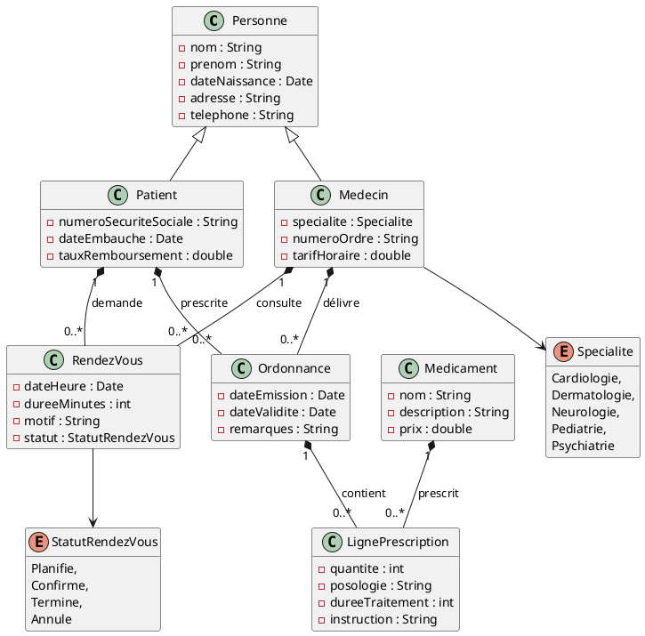

# Application de gestion d'un cabinet médical

## Description du projet et des fonctionnalités implémentées

**Gestion de cabinet médical** est une application de bureau développée en Java avec JavaFX (interfaces décrites en FXML). Elle suit une architecture MVC : des modèles (`Patient`, `Medecin`, `Medicament`, `Ordonnance`, `RendezVous`), des services qui centralisent les données (`GestionPatients`, `GestionMedecins`, `GestionMedicaments`, `GestionOrdonnances`, `GestionRendezVous`) et des contrôleurs qui relient ces données aux vues. Les données sont gérées en mémoire pendant l'exécution et partagées entre les écrans grâce à des services en instance unique (singleton).

L'application s'ouvre sur un écran d'accueil donnant accès à cinq modules :

- **Patients** : consulter la liste, afficher le détail d'un patient, en ajouter et en supprimer.
- **Médecins** : mêmes opérations, avec gestion de la spécialité (liste de choix) et du tarif horaire.
- **Médicaments** : mêmes opérations, avec nom, description et prix.
- **Ordonnances** : créer une ordonnance en sélectionnant un médecin et un patient existants, consulter ses détails (date de validité, statut, prix total) et la supprimer.
- **Rendez-vous** : planifier un rendez-vous en choisissant médecin et patient dans des listes déroulantes, avec date, heure, durée et motif ; consulter le détail (statut, prix de consultation calculé d'après le tarif du médecin) et supprimer un rendez-vous.

La navigation se fait par changement de scène dans la même fenêtre, et chaque liste se met à jour automatiquement après un ajout ou une suppression.

## Membres du groupe

**- @matty_fourmestraux**
**- @baptiste_wagee**
**- @nathan_salome**

## Répartition du travail

| Membre du groupe                                      | Tâches réalisées                 | Ticket associé                                                                             |
|-------------------------------------------------------|----------------------------------|--------------------------------------------------------------------------------------------|
| @nathan_salome                                        | Config tests                     | [#2](https://gitlab.univ-artois.fr/nathan_salome/gestion-cabinet-medical/-/issues/2)       |
| @matty_fourmestraux                                   | Config logger                    | [#1](https://gitlab.univ-artois.fr/nathan_salome/gestion-cabinet-medical/-/work_items/1)   |
| @baptiste_wagee                                       | SOP to logger                    | [#3](https://gitlab.univ-artois.fr/nathan_salome/gestion-cabinet-medical/-/work_items/3)   |
| @nathan_salome                                        | Refactor classe Statistiques     | [#4](https://gitlab.univ-artois.fr/nathan_salome/gestion-cabinet-medical/-/work_items/4)   |
| @matty_fourmestraux                                   | Refactor classe Recherche        | [#5](https://gitlab.univ-artois.fr/nathan_salome/gestion-cabinet-medical/-/work_items/5)   |
| @baptiste_wagee                                       | Ordonnance.getPrixTotal()        | [#6](https://gitlab.univ-artois.fr/nathan_salome/gestion-cabinet-medical/-/work_items/6)   |
| @nathan_salome                                        | RendezVous.prixConsultation()    | [#7](https://gitlab.univ-artois.fr/nathan_salome/gestion-cabinet-medical/-/work_items/7)   |
| @matty_fourmestraux                                   | Tests Recherche                  | [#16](https://gitlab.univ-artois.fr/nathan_salome/gestion-cabinet-medical/-/work_items/16) |
| @baptiste_wagee                                       | Tests Ordonnance                 | [#8](https://gitlab.univ-artois.fr/nathan_salome/gestion-cabinet-medical/-/work_items/8)   |
| @nathan_salome                                        | Refactor MVC + façades           | [#19](https://gitlab.univ-artois.fr/nathan_salome/gestion-cabinet-medical/-/work_items/19) |
| @matty_fourmestraux                                   | Javadoc complète                 | [#18](https://gitlab.univ-artois.fr/nathan_salome/gestion-cabinet-medical/-/work_items/18) |
| @nathan_salome                                        | Tests RendezVous                 | [#9](https://gitlab.univ-artois.fr/nathan_salome/gestion-cabinet-medical/-/work_items/9)   |
| @baptiste_wagee                                       | Javadoc complète                 | [#18](https://gitlab.univ-artois.fr/nathan_salome/gestion-cabinet-medical/-/work_items/18) |
| @nathan_salome                                        | Javadoc complète                 | [#18](https://gitlab.univ-artois.fr/nathan_salome/gestion-cabinet-medical/-/work_items/18) |
| @matty_fourmestraux                                   | ObservableList                   | [#20](https://gitlab.univ-artois.fr/nathan_salome/gestion-cabinet-medical/-/work_items/20) |
| @nathan_salome                                        | Vue Patients                     | [#21](https://gitlab.univ-artois.fr/nathan_salome/gestion-cabinet-medical/-/work_items/21) |
| @baptiste_wagee, @nathan_salome                       | Vue Médecins                     | [#22](https://gitlab.univ-artois.fr/nathan_salome/gestion-cabinet-medical/-/work_items/22) |
| @nathan_salome                                        | Vue Médicaments                  | [#23](https://gitlab.univ-artois.fr/nathan_salome/gestion-cabinet-medical/-/work_items/23) |
| @matty_fourmestraux                                    | Vue Rendez-vous                  | [#24](https://gitlab.univ-artois.fr/nathan_salome/gestion-cabinet-medical/-/work_items/24) |
| @baptiste_wagee, @nathan_salome                       | Vue Ordonnances                  | [#25](https://gitlab.univ-artois.fr/nathan_salome/gestion-cabinet-medical/-/work_items/25) |
| @nathan_salome, @baptiste_wagee                       | Écran d'accueil                  | [#26](https://gitlab.univ-artois.fr/nathan_salome/gestion-cabinet-medical/-/work_items/26) |
| @nathan_salome, @baptiste_wagee, @matty_fourmestraux  | README.md                     | [#27](https://gitlab.univ-artois.fr/nathan_salome/gestion-cabinet-medical/-/work_items/27) |

## Présentation du code de base

### Diagramme des classes du modèle

### Diagramme des classes "services"

```plantuml
@startuml

top to bottom direction


class GestionMedecins {
  - medecins: List<Medecin>
  + rechercherParSpecialite(Specialite): List<Medecin>
  + ajouterMedecin(Medecin): void
  + rechercherParId(int): Medecin
  + mettreAJourMedecin(int, String, String, double, String, String, Specialite): void
  + getNombreMedecins(): int
  + afficherTousLesMedecins(): void
  + rechercherParNumeroOrdre(String): Medecin
  + listerTousLesMedecins(): List<Medecin>
  + rechercherParNom(String): List<Medecin>
  + supprimerMedecin(int): boolean
}
class GestionMedicaments {
  - medicaments: List<Medicament>
  + rechercherParId(int): Medicament
  + supprimerMedicament(int): boolean
  + ajouterMedicament(Medicament): void
  + listerTousLesMedicaments(): List<Medicament>
  + afficherTousLesMedicaments(): void
  + rechercherParNom(String): List<Medicament>
  + getNombreMedicaments(): int
}
class GestionOrdonnances {
  - ordonnances: List<Ordonnance>
  + listerToutesLesOrdonnances(): List<Ordonnance>
  + ajouterPrescription(int, Medicament, int, String, int, String): void
  + creerOrdonnance(Medecin, Patient, LocalDate, String): Ordonnance
  + getOrdonnancesMedecin(Medecin): List<Ordonnance>
  + getOrdonnancesValides(): List<Ordonnance>
  + getOrdonnancesPatient(Patient): List<Ordonnance>
  + afficherToutesLesOrdonnances(): void
  + rechercherParId(int): Ordonnance
  + getNombreOrdonnances(): int
}
class GestionPatients {
  - patients: List<Patient>
  + rechercherParNumeroSecu(String): Patient
  + mettreAJourPatient(int, String, String, String, String, String, double): void
  + afficherTousLesPatients(): void
  + supprimerPatient(int): void
  + ajouterPatient(Patient): void
  + listerTousLesPatients(): List<Patient>
  + rechercherParId(int): Patient
  + getNombrePatients(): int
  + rechercherParNom(String): List<Patient>
}
class GestionRendezVous {
  - rendezVous: List<RendezVous>
  + prendreRendezVous(Patient, Medecin, LocalDateTime, int, String): RendezVous
  + confirmerRendezVous(int): void
  + getRendezVousParStatut(StatutRendezVous): List<RendezVous>
  + terminerRendezVous(int): boolean
  + getRendezVousPatient(Patient): List<RendezVous>
  + rechercherParId(int): RendezVous
  + annulerRendezVous(int): void
  + getRendezVousMedecin(Medecin): List<RendezVous>
  + estDisponible(Medecin, LocalDateTime): boolean
  + getNombreRendezVous(): int
  + afficherTousLesRendezVous(): void
  + listerTousLesRendezVous(): List<RendezVous>
}
class ExpressionArithmetique.Main {
  + main(String[]): void
}


ExpressionArithmetique.Main                -[#595959,dashed]->  GestionMedecins    : "«create»"
ExpressionArithmetique.Main                -[#595959,dashed]->  GestionMedicaments : "«create»"
ExpressionArithmetique.Main                -[#595959,dashed]->  GestionOrdonnances : "«create»"
ExpressionArithmetique.Main                -[#595959,dashed]->  GestionPatients    : "«create»"
ExpressionArithmetique.Main                -[#595959,dashed]->  GestionRendezVous  : "«create»"
@enduml
```

